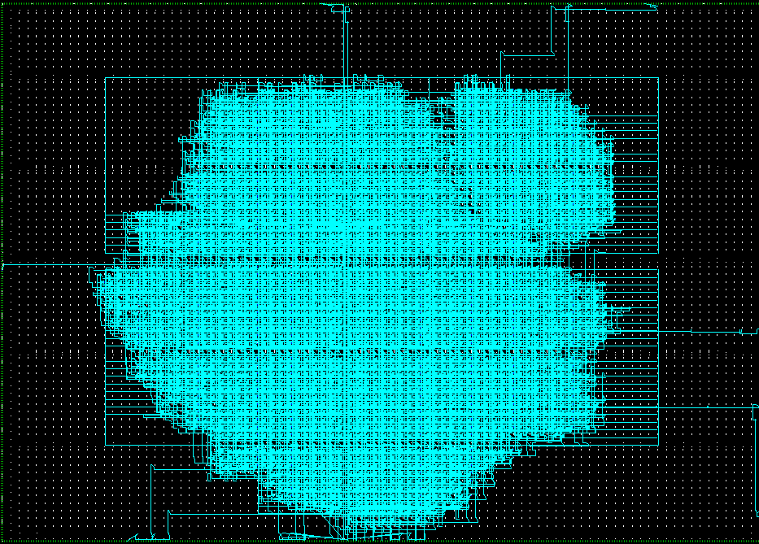

# Embarcatech 3Fase

## Documentação
A referência utilizada para o desenvolvimento e validação dos vetores de teste encontra-se em:
- `docs/NIST.FIPS.197.pdf`

## Próximos Passos
- [x ] Implementar o módulo de Expansão de Chaves
- [x ] Instanciacao e validação (testbench) do SoC com o PicoRV32
- [  ] Portar o Soc para a placa colorlight-i9
- [  ] Integrar o módulo AES existente com o PicoRV32

## Imagens
