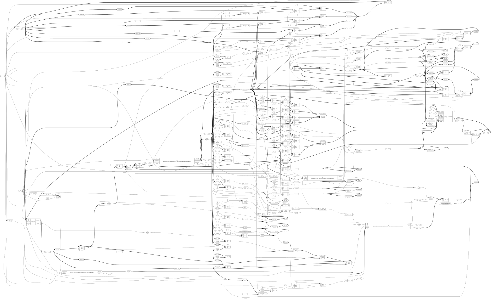
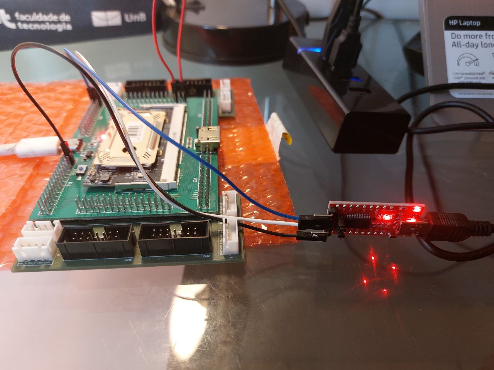
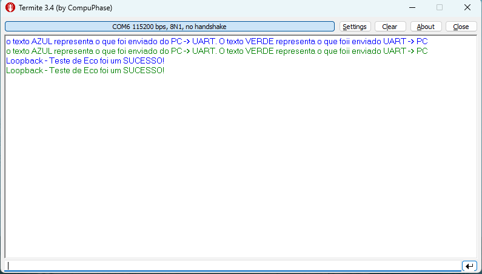

# SoC RISC-V com Acelerador AES-128 - Embarcatech 3ª Fase

Este repositório contém o projeto final da 3ª Fase do programa Embarcatech. O sistema consiste em um System-on-Chip (SoC) baseado no processador RISC-V (PicoRV32), integrado a um acelerador criptográfico de hardware para o algoritmo AES-128 e controlado externamente via interface serial (UART). O projeto foi sintetizado e validado fisicamente em uma FPGA Lattice ECP5 (Colorlight i9).

## Visão Geral do Projeto
Abaixo estão representados o diagrama da arquitetura lógica instanciada no SoC e a montagem física do sistema na placa FPGA.

---

## Estrutura do Repositório

- `rtl/`: Códigos-fonte em Verilog descrevendo o hardware (CPU, AES, UART, Interconexões).
- `firmware/`: Códigos em linguagem C e Linker Scripts executados pelo PicoRV32.
- `sim/`: Arquivos de testbench e simulação.
- `scripts/`: Scripts auxiliares de automação.
- `validation/`: Scripts em Python.
- `Makefile`: Automação da compilação do firmware.
- `docs/`: Documentação de referência, imagens e diagramas.

---

## Demonstrações em Vídeo
Clique nas thumbnails abaixo para visualizar os testes na placa:

## Visão Física e Layout

## Simulação: Bloco AES
Validação dos vetores de teste matemáticos da criptografia.

## Simulação: SoC PicoRV32
Execução de código e validação das instruções do processador RISC-V.

## Comunicação UART
Teste de transmissão e recepção serial.

## Erros da Placa (Debug)

