# Embarcatech 3Fase

## Documentação
A referência utilizada para o desenvolvimento e validação dos vetores de teste encontra-se em:
- `docs/NIST.FIPS.197.pdf`

## Imagens e Resultados

### Visão Física (Layout)
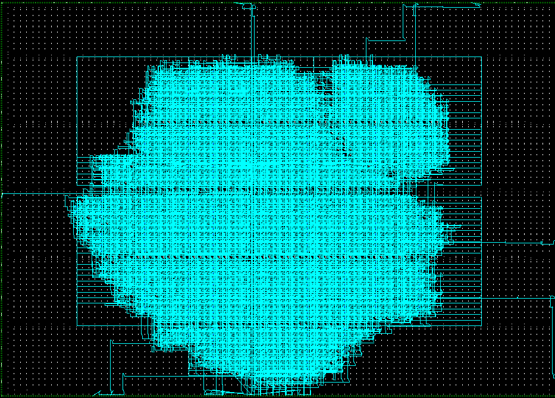

### Simulação: Bloco AES
Validação dos vetores de teste.
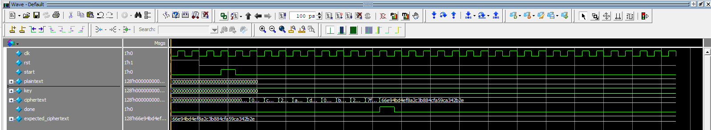
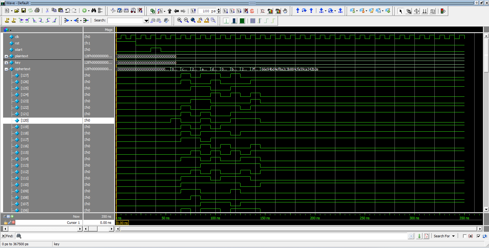
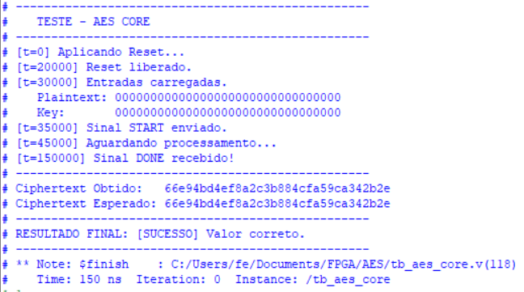

### Simulação: SoC PicoRV32
Execução de código e validação do processador RISC-V.
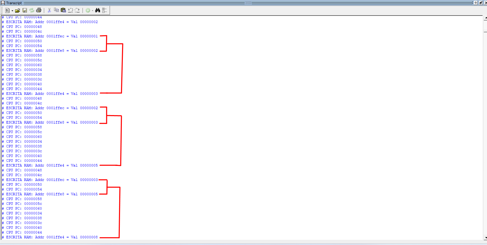
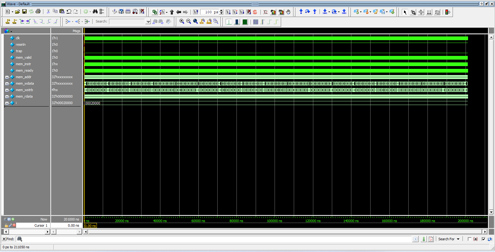
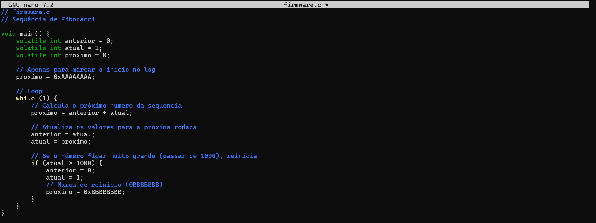

### Simulação: Comunicação UART
Teste de transmissão e recepção serial.
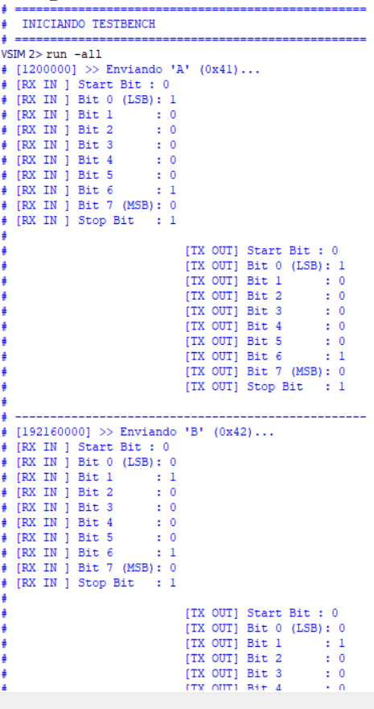
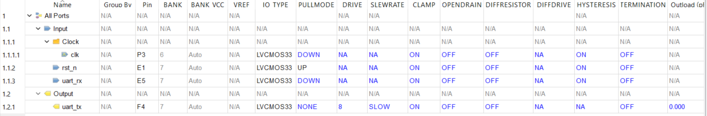

### Erros da placa
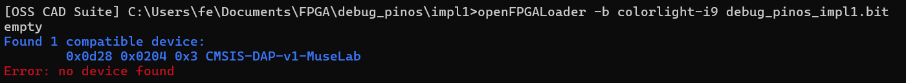
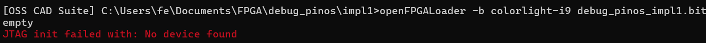